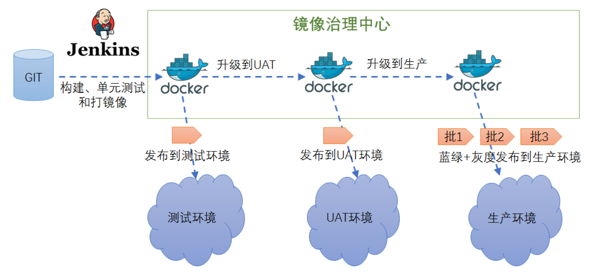

# 架构初识：阵列在前

## 前言

> 集百家所长，海纳百川，有容乃大
>

## 架构变迁

##### 单体架构 -> 垂直架构 -> SOA架构 -> 微服务架构

单体架构：所有的功能模块都集中在一个项目工程中，打包成一个独立的包部署在服务器中，共用一个数据库，不分库分表。

垂直架构：在单体架构的基础上按业务垂直拆分为若干系统，每个系统可独立部署运行，此时服务间并无通信。

SOA架构：一种基于分布式的面向服务的架构，将不同业务按照服务拆分，服务间通过接口和协议联系起来。

微服务架构：对服务进行细粒度的拆分，服务间通过服务网关进行通信，由服务注册中心管理所有的服务。

## 架构思维

##### 自顶向下构建

1. 抽象思维
2. 分层思维
3. 分治思维
4. 演化思维

##### 自底向上推导

1. 业务概念模型和业务流程
2. 系统模型
3. 系统流程
4. 非功能的系统支持

##### 领域驱动设计

1. 用户需求场景分析
2. 识别业务场景中的实体对象
3. 领域划分
4. 评估合理性，不断优化

##### 基于数据驱动

1. 基于大数据统计分析结果
2. 以数据思维架构系统

## 技术选型
------

- 网关：Nginx、Kong、Zuul
- 缓存：Redis、MemCached、OsCache、EhCache
- 搜索：ElasticSearch、Solr
- 熔断：Hystrix、resilience4j

------

- 负载均衡：DNS、F5、LVS、Nginx、OpenResty、HAproxy
- 注册中心：Eureka、Zookeeper、Redis、Etcd、Consul
- 认证鉴权：JWT、Token、OAuth2、SSO
- 消费队列：RabbitMQ、ZeroMQ、Redis、ActiveMQ、Kafka

------

- 系统监控：Grafana、Prometheus、Influxdb、Telegraf、Lepus
- 文件系统：OSS、NFS、FastDFS、MogileFS
- RPC框架： Dubbo、Motan、Thrift、grpc

------

- 构建工具：Maven、Gradle
- 集成部署：Docker、Jenkins、Git、Maven
- 分布式配置：Disconf、Apollo、Spring Cloud Config、Diamond
- 压测：LoadRunner、JMeter、AB、webbench

------

- 数据库：MySql、Redis、MongoDB、PostgreSQL、Memcache、HBase
- 网络：专用网络VPC、弹性公网IP、CDN
- 数据库中间件：DRDS、Mycat、360 Atlas、Cobar (不维护了)
- 分布式框架：Dubbo、Motan、Spring-Could

------

- 分布式任务：XXL-JOB、Elastic-Job、Saturn、Quartz
- 分布式追踪：Pinpoint、CAT、zipkin
- 分布式日志：elasticsearch、logstash、Kibana 、redis、kafka
- 版本发布：蓝绿部署、A/B测试、灰度发布／金丝雀发布

## 持续交付

## 链路监控

## 监控架构

#### 四层监控

- 前端监控：IP、PV、运营商、系统、性能、状态码
- 业务监控：登录、注册、下单、支付
- 应用层监控：service、sql、cache、相应时间
- 系统监控：物理机、虚拟机、容器，CPU、内存、IO、硬盘
- 基础监控：网络、交换机、路由器

#### 监控分类

- 日志监控
- 调用链监控
- 告警系统
- Metrics监控
- 监控检查

Docker、Grafana、Prometheus、Telegraf、Influxdb、Lepus、Elasticsearch、Logstash、Kibana、kafka、node插件、dashboards仪表盘、钉钉、邮件、微信。

------

## 服务框架和治理

## 架构必备

- 负载均衡（负载均衡算法）
- 反向代理
- 服务隔离
- 服务限流
- 服务降级（自动优雅降级）
- 失效转移
- 超时重试（代理超时、容器超时、前端超时、中间件超时、数据库超时、NoSql超时）
- 回滚机制（上线回滚、数据库版本回滚、事务回滚）

## 高并发

- 应用缓存
- HTTP缓存
- 多级缓存
- 分布式缓存
- 连接池
- 异步并发

## 分布式事务

- 二阶段提交(强一致)
- 三阶段提交(强一致)
- 消息中间件(最终一致性)，推荐阿里的RocketMQ

## 队列

- 任务队列
- 消息队列
- 请求队列

## 扩容

- 单体垂直扩容
- 单体水平扩容
- 应用拆分
- 数据库拆分
- 数据库分库分表
- 数据异构
- 分布式任务

## 网络安全

- SQL注入
- XSS攻击
- CSRF攻击
- 拒绝服务（DoS，Denial　of　Service）攻击